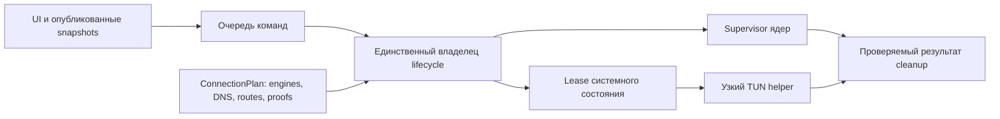

# Аудит RouteDeck — 5 сентября 2026

Аудит исходников, состояния тестов и архитектуры выполнен с тремя независимыми
направлениями проверки: TUN/helper, runtime/System Proxy, конфигурация/аналоги.
Исправлены подтверждённые ошибки; успешная работа TUN на реальном подключении
пока **не установлена**. Проходящие тесты предыдущей версии не доказывали
безопасность её отката и восстановления.

Текущий VPN пользователя, Windows Proxy, DNS, маршруты, адаптеры и службы не
изменялись. Приложение, повышенный helper и VPN-ядра не запускались. Реальные
подписки и пользовательские журналы не читались. Проверки использовали mocks,
временные файловые фикстуры и существующие локальные IPC/loopback-тесты.

## Ядро и текущая неисправность TUN

В [lockfile](../engine/sing-box.lock.json) закреплён **sing-box 1.13.21**.
Официальный GitHub `releases/latest` на дату аудита указывает на стабильный
**1.14.0 от 31 августа 2026**. Это не последнее ядро. В 1.14 меняются DNS/TUN
возможности, Hysteria2 и транзитивные компоненты; простой перевод номера версии
не является проверенным обновлением. Lockfile и runtime-артефакты в этом изменении
не обновлялись. [Официальный релиз 1.14.0](https://github.com/SagerNet/sing-box/releases/tag/v1.14.0).

Проверки `sing-box check` и data plane в этом аудите не выполнялись. Подтверждён
pin исходников; версия и хеш отдельной установленной пользователем
portable-сборки здесь не проверялись.

[История инцидентов](runtime-incident-backlog.md) уже содержит два разных сбоя:
DNS не попадал в hijack без sniff, а позднее helper отключался с Windows error 232.
Первое исправление уже было в исходниках; текущий аудит не выдаёт его за новую
находку. Ошибка 232 обозначает обрыв канала, но сама по себе не устанавливает
причину завершения helper. Успешного контрольного TUN-подключения после старых
исправлений в имеющихся материалах нет.

## Исправления

| Приоритет | Подтверждённая проблема | Изменение и проверка |
| --- | --- | --- |
| P1 | При неудачной публикации System Proxy выполнялся безусловный откат поверх возможных изменений другого VPN. | Откат принадлежит контроллеру и проходит сравнение текущего состояния с журналом. Активный чужой manual/PAC/autodetect proxy не замещается автоматически. Mock-тесты гонок и частичного применения. |
| P1 | WinInet мог сообщать DIRECT при активном flat `ProxyEnable`; это уже наблюдалось в проекте. | Перед чтением ownership для publish/restore проверяется согласованность WinInet и flat registry. Противоречие, RAS и machine policy блокируют запись. Точные snapshots не синтезируются. |
| P1 | Журнал System Proxy не имел уникального маркера; запись не гарантировалась до изменения Windows, evidence конфликта удалялось. | Журнал v2 и случайный 128-bit marker в bypass; `create_new`, ограниченное чтение, `sync_all`. Конфликт архивируется без перезаписи, повтор завершения архива идемпотентен. Старые/повреждённые журналы сохраняются для разбора. |
| P1 | Монитор снимал управление child даже при ошибке восстановления Windows; повтор recovery мог сбросить статус при живой сессии. | Кнопка Stop, ошибки монитора и повтор recovery используют `stop_active_locked`. Управление и метаданные сохраняются до проверенного завершения. Тесты отказов restore/stop и успешного повтора. |
| P1 | Второй GUI мог начать startup recovery работающего первого экземпляра. | `AppInstanceGuard` получает эксклюзивный Windows handle до любого восстановления и удерживает его весь срок контроллера. Тест подтверждает, что второй экземпляр не вызывает даже mock recovery. Старые версии без этой блокировки не участвуют в протоколе координации. |
| P1 | Повышенный helper разрешал неизвестные вложенные поля конфигурации, включая произвольный `log.output`. | Закрытый граф разрешённых полей и типов перед запуском. Hostile-тесты файловых/плагинных/дополнительных возможностей и положительные тесты реальных generated-конфигураций разных протоколов. |
| P1 | Ошибки после запуска TUN child обходили явный rollback; исчезновение маршрутов могло быть недостаточным условием успешного Stop. | Общая `with_tun_cleanup` охватывает startup после запуска, отправку Started и выходы из рабочего IPC. Complete требует успешных stop, проверки адаптера/маршрутов и завершения journal. Mock-матрицы отказов каждой стадии. |
| P2 | Чтение статуса могло ждать mutex, удерживаемый во время UAC/HTTPS. | Отдельный опубликованный snapshot с ревизией; status и diagnostics не ждут lifecycle lock. Тест блокирует стартовый probe и одновременно читает состояние. |

Код: [controller](../src-tauri/src/application.rs),
[System Proxy](../src-tauri/src/system_proxy.rs),
[TUN helper](../src-tauri/src/tun_helper.rs),
[instance lease](../src-tauri/src/app_instance.rs).

Документация аутентификации исправлена: GUI проверяет закреплённый hash helper,
а helper проверяет PID, время создания и sibling path GUI. Взаимной проверки
hash двух бинарников нет. Закрытая конфигурационная граница обязательна независимо
от UAC. Защита от вредоносного native-процесса того же пользователя не обещается.

## Открытые вопросы до признания TUN стабильным

1. **P1 — аварийная целостность TUN journal.** `write_journal` пока делает
   seek/truncate/write. При сбое питания или диска можно потерять последнюю валидную
   запись. Нужна атомарная смена защищённой записи или журнал последовательных
   завершённых записей, с тестами сбоя на каждой операции. Новый cleanup сохраняет
   файл для разбора, но не устраняет этот дефект формата хранения.
2. **P1 — полнота teardown.** Обычный stop по-прежнему принудительно завершает
   engine. Проверка очистки охватывает адаптер и маршруты, а не полный DNS/WFP
   жизненный цикл. Это не доказательство утечки: dynamic WFP/per-TUN DNS могут
   освобождаться системой. Требуются graceful-stop стратегия и fault-тесты в VM.
   Потеря IPC после уже успешной очистки может оставить GUI в консервативном
   RecoveryRequired; нужен проверяемый результат завершения сессии.
3. **P1 — bootstrap DNS.** У VLESS/REALITY используется Xray sidecar. Привязка
   outbound socket к физическому интерфейсу не делает разрешение имени endpoint
   независимым от захваченной DNS. Нужен явный bootstrap-план с отдельными ролями
   DNS. Текущий application всегда выбирает CurrentNetwork, `vpn_dns` не задан.
4. **P1 — доказательство захвата.** Прирост общих счётчиков TUN вместе с HTTPS
   полезен, но фоновый трафик может дать прирост вместо проверочного запроса.
   Нужна атрибуция конкретного probe к сессии/маршруту. Running process и обычный
   успешный HTTPS не должны заменять это доказательство.
5. **P2 — управление операциями.** Snapshot устранил блокировку наблюдения,
   но старт всё ещё держит внутренний state lock на длительных операциях.
   Следующий шаг — один lifecycle worker, отмена по generation и неизменяемый
   ConnectionPlan. Переключение профиля/режима должно быть последовательностью
   завершённых транзакций с явным результатом cleanup.
6. **P2 — диагностика пустой подписки.** Ошибки чтения/схемы/парсинга сливаются,
   отсутствие файла не записывается, начало подключения очищает журнал.
   Нужна отдельная неизменяемая запись старта с конечными кодами причин и
   обезличенной идентичностью хранилища. Причина ранее наблюдавшегося инцидента
   не установлена.

WinInet не предоставляет атомарного compare-and-swap. Проверки и marker уменьшают
гонки, но не дают абсолютной гарантии против параллельной записи между чтением
и setter. Журналы без доказанного владения нельзя автоматически удалять или
«чинить» перезаписью чужой конфигурации.

## Что полезно у аналогов

[v2rayN 7.24.9 routing](https://raw.githubusercontent.com/2dust/v2rayN/7.24.9/v2rayN/ServiceLib/Services/CoreConfig/Singbox/SingboxRoutingService.cs)
защищает пути собственных ядер правилами до пользовательской маршрутизации;
[DNS service](https://raw.githubusercontent.com/2dust/v2rayN/7.24.9/v2rayN/ServiceLib/Services/CoreConfig/Singbox/SingboxDnsService.cs)
разделяет bootstrap/direct/remote DNS. Полезно перенести разделение ответственности,
предварительно согласовав его с физической привязкой RouteDeck.

[Throne generator](https://raw.githubusercontent.com/throneproj/Throne/dev/src/configs/generate.cpp)
разделяет BuildContext, DNSDeps и TunDeps, имеет отдельный bootstrap DNS inbound
для Xray и аутентификацию SOCKS bridges. Это хороший ориентир для ConnectionPlan
и границы между ядрами. Их [Windows-рекомендации](https://throneproj.github.io/advanced/windows_tun_mode/)
по глобальным DNS policy и отключению QUIC не переносятся автоматически в RouteDeck.

Предлагаемое разделение, пока реализованное только частично:



## Проверки и дальнейшая последовательность

Исходная база: **233 Rust + 48 frontend-тестов прошли**, несмотря на найденные
дефекты. После изменений: **260 Rust-тестов прошли**, включая 27 новых тестов.
Frontend: **48/48**, production build и `cargo check --all-targets` прошли.
Форматирование изменённых Rust-файлов и `git diff --check` проверены.
Зависимости установлены строго из
существующего lock/cache через `npm ci --offline --ignore-scripts --no-audit --no-fund`;
версии и оба lockfile не менялись.

Воспроизведение безопасных проверок:

```powershell
cargo test --locked --offline --manifest-path src-tauri/Cargo.toml --lib -- --test-threads=1
cargo check --locked --offline --manifest-path src-tauri/Cargo.toml --all-targets
node --test tests/frontend-boundary.test.ts tests/production-bundle-check.test.mjs tests/tauri-command-permissions.test.mjs
npm --ignore-scripts run build
```

Следующая последовательность: закрыть оставшиеся journal/teardown/DNS/probe
вопросы; отдельно проверить миграцию и артефакты 1.14.0; выполнить проверки ядра
на фикстурах; затем Windows VM с чистым снимком и вторым VPN. Только после этого —
согласованный ручной тест на основном ПК и работа над автоматическими
переключениями/UX. Успех unit-тестов не заменяет эти этапы.

Полная матрица: [test-matrix.md](test-matrix.md). Существующее ограничение на
host-тесты сохранено; текущий VPN пользователя не требуется отключать для
продолжения работы с кодом и mocks.
